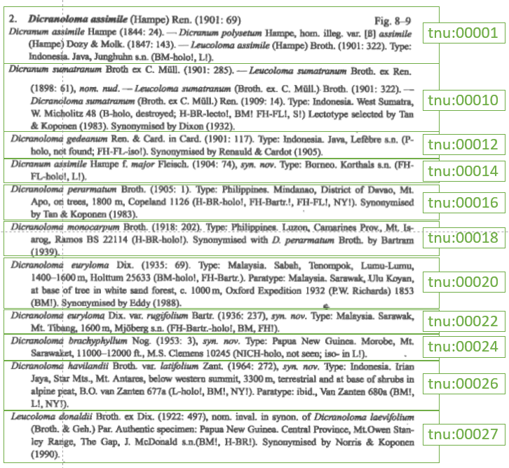
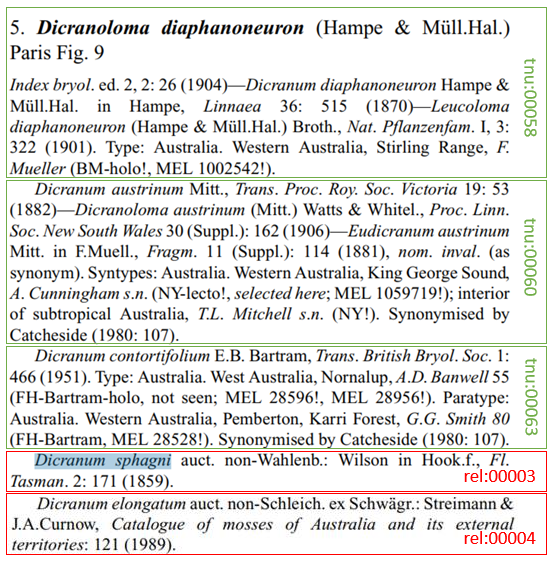

# Dicranoloma example explained

Example has been worked out in a [Google Sheet](https://docs.google.com/spreadsheets/d/1ZTzHKQOgECpwUmQyDcDfnNnk6n6UK-FPCvo0qFDbJjw/edit?usp=sharing).

Klazenga, N. (1999) A revision of the Malesian species of _Dicranoloma_
(Dicranaceae, Musci). _Journal of the Hattori Botanical Laboratory_ **87**: 1–130. (p. 48 & p. 51)

Klazenga, N. (2003). A revision of the Australasian species of *Dicranoloma* (Bryophyta, Dicranaceae). *Australian Systematic Botany* **16**: 427–471. (p. 440)

All the Taxonomic Name Usages in the two examples I provided are outlined in green in the images above.

### Why are homotypic synonyms not TNUs (i.m.o. of course)?

*Dicranum diaphanoneuron* Hampe & Müll.Hal. sensu Hampe 1870 (tnu:00052) is a homotypic synonym of *Dicranoloma diaphanoneuron* (Hampe & Müll.Hal.) Paris sensu Paris 1904 (tnu:00054) no matter what Klazenga 2003 (ref:00039) says about it. The statement has no information in it, as it can be inferred from the fact that tnu:00052 and tnu:00054 have the same protonym (tnu:00052). *Dicranum diaphanoneuron* Hampe & Müll.Hal. sec. Klazenga 2003 is the same TNU as *Dicranoloma diaphanoneuron* (Hampe & Müll.Hal) Paris sec. Klazenga 2003 (tnu:00053).

Likewise, *Dicranoloma austrinum* (Mitt.) Watts & Whitel. 1906 sec. Klazenga 2003 would be the same TNU as *Dicranum austrinum* Mitt. sec. Klazenga 2003 (tnu:00060).

### Why are misapplied name assertions not TNUs (also i.m.o.)?

The statement "*Dicranum spagni* auct. non-Wahlenb.:Wilson in Hook.f., Fl. Tasman. 2: 171 (1859)" is not so much a usage of the name *Dicranum sphagni* Wahlenb. (tn:00026), but merely a reference to another Taxonomic Name Usage, *Dicranum sphagni* Wahlenb. sec. Wilson 1859 (tnu:00064). Structurally and content-wise, the statement "*Dicranum sphagni* was misapplied to *Dicranoloma diaphanoneuron* by Wilson (1859)" is much more similar to the statement "*Dicranum austrinum* was synonymised with *Dicranoloma diaphanoneuron* by Catcheside (1980)", which was implicitly made just above (under tnu:00060) than to, for example, the statement "*Dicranum austrinum* is a heterotypic synonym of *Dicranoloma diaphanoneuron*" (which is tnu:00060).

Moreover, Klazenga (2003) was not the publication where the assertion that Wilson's (1859) usage of *Dicranum sphagni* is a misapplication, as *Dicranum austrinum* was based on *Dicranum sphagni* auct. non Wahlenb: Wilson. So the statement in Klazenga 2003 was just a piece of inference based on the assertion that *Dicranum austrinum* is a synonym of *Dicranoloma diaphanoneuron* (I didn't take Catcheside's word for that bit). Also, *Dicranum elongatum* auct. non-Wahlenb.: Streimann & J.A.Curnow is the same thing as *Dicranum austrinum* auct. non-Wahlenb.: Wilson, as *Dicranum sphagni* is a superfluous name, which correct name is *Dicranum elongatum*.

Finally, at least the botanical code never speaks of 'misapplications', but of 'misapplied names', so, if one wants to treat these things ("misapplications") in accordance with the Code (which for me is the botanical one), they should be treated as different Name strings, not different usages of the same Name.
