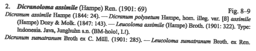
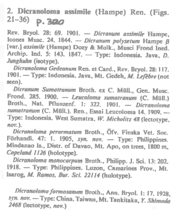
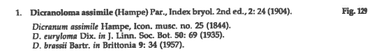
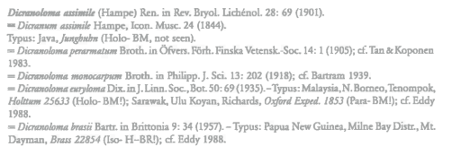
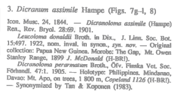

# Example: Dicranoloma assimile

Example has been worked out in a [Google Sheet](https://docs.google.com/spreadsheets/d/1ZTzHKQOgECpwUmQyDcDfnNnk6n6UK-FPCvo0qFDbJjw/edit?usp=sharing). Excerpts from the
publications where the data has been taken from are (rather poorly) reproduced
below. I've thrown in some of the treatments of previous workers.

I have created the Resource Relationships for basionyms and heterotypic synonyms,
but I think it would be preferable to deal with 'basionym' and 'acceptedNameUsage'
(which is already in Darwin Core) properties in the TNU class. This way we separate
between nomenclatural relationships from concept relationships, as well as between
many-to-one and many-to-many relationships.

 

 

Klazenga, N. (1999) A revision of the Malesian species of _Dicranoloma_
(Dicranaceae, Musci). _Journal of the Hattori Botanical Laboratory_ **87**: 1–130.
— _Note_: _Dicranoloma laevifolium_ (of which _Leucoloma donaldii_ was invalidly
published as a synonym) is a synonym of _Dicranoloma braunii_ (according to me),
so I haven't included it in my example. _Dicranoloma laevifolium_ sensu Dixon
(1922) is based on a misidentification of the type of _Dicranum laevifolium_, or,
more likely, Dixon not having seen the type at all, but basing his concept on the
original description or subsequent descriptions and other collections identified
as _Dicranum laevifolium_.

Tan, B.C. & T. Koponen (1983) _Dicranoloma_ (Musci, Dicranaceae) in Southeast
Asia, with special reference to the Philippine taxa. _Annales Botanici Fennici_
**20**: 317–334. — _Note_: I consider _Dicranoloma formosanum_ and _Dicranoloma
brassii_, which is cited in the following two papers, synonyms of _Dicranoloma
dicarpum_, so have not added these to the example yet. I would not consider Tan
and Eddy's treatments misidentifications, but different concepts
from mine. While there were only two known specimens from Taiwan at the time of
my revision, both cited in the original publication of _Dicranoloma formosanum_,
there are several collections from Papua New Guinea subsequent to the publication
of _Dicranoloma brassii_. _Dicranoloma dicarpum_ is an Australasian species, which
was not know from the region before Norris & Koponen synonymised _Dicranoloma
brassii_ with it.

Eddy, A. (1988) _A handbook of Malesian mosses. Vol. 1. Sphagnales to Dicranales_.
British Museum (Natural History), London.

Tan, B.C. (1989) The bryophytes of Sabah (North Borneo) with special reference to
the BRYOTROP transect of Mount Kinabalu. _Willdenowia_ **18**: 497–512.

Norris, D.H. & T. Koponen (1990) Bryophyte Flora of the Huon Peninsula, Papua
New Guinea. XXXV. Dicranaceae and Dicnemanaceae (Musci). _Acta Botanica Fennica_
**139**: 1–64.
