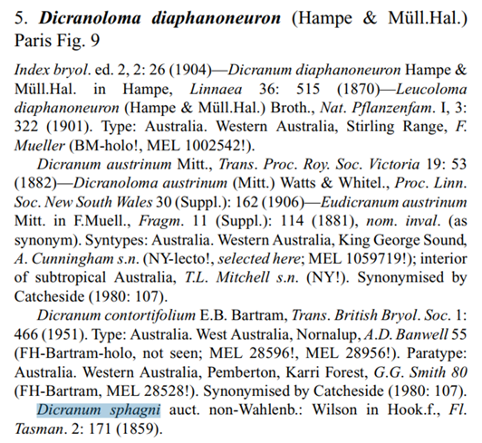
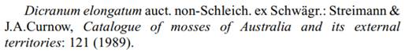

# Example Dicranoloma diaphanoneuron sec. Klazenga 2003

Excerpt op publication to go with Dicranoloma diaphanoneuron sec. Klazenga 2003
example in [Google Sheet](https://docs.google.com/spreadsheets/d/1ZTzHKQOgECpwUmQyDcDfnNnk6n6UK-FPCvo0qFDbJjw/edit?usp=sharing)
(starting row 56 in taxonomic_name_usages worksheet).

Klazenga, N. (2003). A revision of the Australasian species of *Dicranoloma* (Bryophyta, Dicranaceae). *Australian Systematic Botany* **16**: 427–471.

(p. 440)

