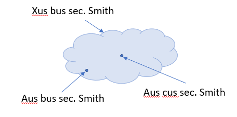
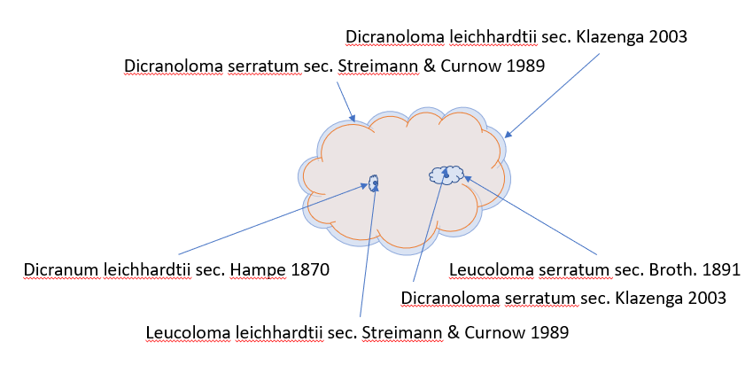

# Homo- and heterotypic Synonyms

**Email from @deepreef, 2019-03-08:**

...

Just to be clear, asserted synonyms are absolutely TNUs (a fundamental property of any TNU is whether the authors treated it as valid or as a synonym of another name).  The question is whether or not homotypic synonyms (specifically alternate combinations) are also TNUs.

For example, imagine a Treatment for Aus bus L. within the publication of Smith, with a synonymy that looks something like this:

```
Xus bus (L.)
      Aus bus L. sec L.
      Dus bus (L.) sec Jones
      Aus cus Brown sec Brown
      Dus cus (Brown) sec Pyle
```

The TNUs we can extract from the above Treatment associated with the Smith publication definitely include the following:
1.	Genus Xus, treated as a valid genus
2.	Species bus (L.), treated as a valid species within Xus.
3.	Species cus (Brown), treated as a synonym of bus (L.)

This allows for documenting the full set of heterotypic synonymy as asserted by Smith.

However, what’s not clear is whether there are other implied TNUs included in the above treatment.  For example, is there a separate TNU for “Aus cus Brown sec Smith” and “Dus cus (Brown) sec. Smith”?  What about the genus Dus sec. Smith?  We definitely have TNUs in other publications for these names (e.g., within the Brown publication we have one for the genus Aus and one for the species cus; and likewise we have TNUs in L for Aus and bus, in Jones for Aus and bus, and in Pyle for Dus and cus) – but do we also mint TNUs *within the Smith publication* for the genus “Dus” or the combination “Dus bus” (or, for that matter, the genus “Aus”, or combinations “Aus bus” and “Dus cus”)? We certainly have instances of *Appearances* of these alternate combinations within the publication of Smith, but I don’t think we should think of them as TNUs within Smith.

In my mind, the answer is definitely “no” for the combinations (homotypic synonyms), and “maybe” for the genera (i.e., Aus sec. Smith and Dus sec Smith).

The question is about how much we can derive concept mappings from the above listing.  For example, can we deduce that “the circumscription of Xus bus (L.) sec Smith includes the circumscription of Dus bus (L.) sec Jones”?  Or, can we only assert that “the circumscription of Xus bus (L.) sec Smith includes the type specimen of bus L.” [regardless of what genus someone combines that species name with]?  I would say the latter is all we can say with the limited information provided – mapping circumscriptions requires much more detailed (and likely subjective) analysis.

This is why I say that we should not consider “Aus bus L. sec Smith”,  “Dus bus (L.) sec Smith” and “Dus cus (Brown) sec Smith” as separate instances of TNUs. Given that we can’t make inferences about taxon circumscriptions from listings within synonymies, we gain no information by minting three TNUs within Smith for the species “bus” (one for Xus bus (L.) sec Smith, another for Aus bus L. as a synonym of Xus bus (L.) sec. Smith; and another for Dus bus (L.) sec Jones as a synonym of Xus bus (L.) sec. Smith).  The latter two are automatically implied by the first.

The way I see it, we gain nothing by creating additional TNUs for Aus bus L. sec Smith and Dus bus (L.) sec Smith, because we already have TNUs for Aus bus L. sec L. and Dus bus (L.) sec Brown.

**Email from @nielsklazenga, 2019-03-08:**

I completely agree with what you just said, except that I don’t have a strong opinion about whether homotypic synonyms are TNUs or not. I think the circumscription of a synonym encompasses just the type, so Aus bus sec. Smith and Dus bus sec. Smith. are obviously the same concept and so are Aus cus sec. Smith and Dus cus sec. Smith, but circumscription-wise Aus bus sec. Smith is as different from Xus bus sec. Smith as Aus cus sec. Smith is. The only reason Aus bus is a homotypic synonym and Aus cus a heterotypic synonym is that Aus bus was published before Aus cus. If it had been the other way around (or Aus cus was conserved against Aus bus), it would have been Xus cus and Aus bus would be the heterotypic synonym and Aus cus the homotypic one, all entities still having the same circumscription. Also, I have just migrated a database with names of fungi for which for half of the names that should have a basionym I didn’t know what the basionym was, so I find it easier to treat all synonyms the same (also, I am a botanist).



Agreed about the misapplications. That was the whole point I was trying to make (and think I made) in that comment in the Google Doc. I think the onus is on the people who want to include misapplications to provide a definition of what they are and how they could be shoehorned into a system of Taxonomic Name Usages.

**Real world example:**



**Email from @deepreef, 2019-03-08:**

Hi Niels,

> I think the circumscription of a synonym encompasses just the type,

Well, to me the word “circumscription” implies ALL individuals (alive, dead, and yet to be born) included within a taxonomic concept. So in my mind a “circumscription” never encompasses only one specimen (e.g., the type).  Rather, I would say something like “a synonym is defined not by the extent to which two circumscriptions overlap, but rather whether or not two circumscriptions both encompass more than one type specimen”.  So, two circumscriptions may overlap with each other (thinking of a Venn diagram), but they are only synonyms if more than one type specimen is included within the region of overlap.  In practice, the vast majority of circumscription intersections are either “congruent” (perfectly matching boundaries), or “includes”/”included in” (one circumscription contained entirely within another).  But the key is that a “synonym” at least a taxonomic synonym – if not a nomenclatural synonym) is established when more than one type specimen is included within one or more circumscriptions.

I hope that makes sense?

> so Aus bus sec. Smith and Dus bus sec. Smith. are obviously the same concept and so are Aus cus sec. Smith and Dus cus sec. Smith,

Yes, because if we agree that a concept is a circumscription, then its nature is defined by its content, and its content doesn’t change with a different classification.  The placement of the species “bus” within either “Aus” or “Dus” changes only the implied classification; it has no impact on the concept (if we define concept as circumscription).

> but circumscription-wise Aus bus sec. Smith is as different from Xus bus sec. Smith as Aus cus sec. Smith is.

I’m not sure I follow. In my example, Smith only asserts one circumscription, which encompasses the type specimen of “bus” and the type specimen of “cus” (=heterotypic synonymy).

> The only reason Aus bus is a homotypic synonym and Aus cus a heterotypic synonym is that Aus bus was published before Aus cus.
> If it had been the other way around, it would have been Xus cus and Aus bus would be the heterotypic synonym and Aus cus the
> homotypic synonym, all entities still having the same circumscription.

Yes, but I think the inclusion of genera (which, while forming part of the “name” are really representative of classifications) only makes things confusing.  The part we need to know via TNUs is that Smith included the type specimens of the two names “bus” and “cus” within the same taxon circumscription, and hence they are heterotypic synonyms. Rules of the Code give priority to “bus”, so that’s the one Smith uses for the valid name.  We don’t need to know anything about genus placements (= classifications) to make these interpretations.  The Homotypic synonyms are self-evident, because they are all anchored to the same type (proxied by being anchored to the same Protonym).  We don’t need to represent them as such under Smith’s publication, because they are self-evidently homotypic synonyms by virtue of being anchored to the Protonym for bus L. and cus Brown, respectively. Thus, creating a TNU for these alternate combinations under Smith doesn’t give us any real useful information to make inferences with.  We MUCH have the TNUs for both bus and cus within Smith to represent the asserted heterotypic (taxonomic) synonymy.  Separately, the assertion of bus as the senior synonym and cus as the junior synonym reflects an assertion about nomenclatural priority.  And separately still, the placement of bus within the genus Xus is yet another assertion, about the hierarchical classification of the taxon, which also happens to complete the nomenclatural binominal (required by all Codes).

So, looking at your diagram, I think it’s cleaner if you don’t include the genus names associated with the arrows pointing to the two dots, because it doesn’t matter what genus the species is placed in – the arrows always point to the same two dots.  So just label it as [AnyGenus] bus sec. Smith and [AnyGenus] cus sec. Smith.  In fact, there is no need to even include the “sec. Smith” in these labels, because again they represent type specimens – NOT taxon concepts.  Thus, it’s probably best to have your cloud labeled as “Xus bus sec. Smith”, and the two dots labelled as “type specimen of Aus bus Linnaeus” and “type specimen of Aus cus Brown”.

Aloha,
Rich

**Email from @nielsklazenga, 2019-03-08:**

Hi Rich,

For me it is the other way around. There is the taxon concept, or my circumscription of a taxon I recognise. Then the name that goes with the concept is the oldest name which type falls within that concept. A name is a synonym just by virtue of its type falling within my concept and being younger than another name whose type falls within that concept. So my concept of a synonym is really only the single specimen, and so is the circumscription (as that is the same thing). I am not comparing concepts, but specimens, and I think synonymy is not a concept-relationship.

Our difference of opinion might be explained by your next statement: ‘In practice, the vast majority of circumscription intersections are either “congruent” (perfectly matching boundaries), or “includes”/”included in”’. That is certainly not the case in the mosses I have worked on. There is lots of overlap between concepts of consecutive authors and it is very hard to even know what the concepts of previous authors are and the only way to do so is by the specimens they have identified.

Regarding “…, but I think the inclusion of genera … only makes things confusing“, without the different genus parts there wouldn’t be nomenclatural synonyms, would there? Also, you included the genera (or genus part); I just followed your example.

Also, regarding “Thus, it’s probably best to have your cloud labeled as “Xus bus sec. Smith”, and the two dots labelled as “type specimen of Aus bus Linnaeus” and “type specimen of Aus cus Brown”.”, the whole point I am trying to make is that Aus bus sec. Smith and ‘type specimen of Aus bus L.’ are exactly the same thing (as are Aus cus sec. Smith and ‘type specimen of Aus cus Brown’). The diagram was about name usages, so I used the name usage labels.

I think our differences are just a zoologist and a botanist arguing… (very late here, have to go home).

Niels

**Email from @deepreef, 2019-03-09:**

Hi Niels,

I’m not sure how that’s the other way around, because I think we’re saying exactly the same thing but in different ways.  It seems we both agree that the notion of “synonym” depends entirely on type specimens, and which concept(s) they fall within. The difference between junior/senior synonym depends on priority of the names attached to the type specimens, as prescribed by the relevant Code.  I see now where the confusion might have been.  When I said “they are only synonyms if more than one type specimen is included within the region of overlap”, I meant the names attached to the types are synonyms, not the concepts themselves.  To me, the relationships between concepts are congruent, overlaps, includes/included in, and excludes.  Synonymy is about the names that get attached to those concepts by virtue of the concept circumscriptions including one or more type specimens within them.

That’s interesting that mosses involve many “overlap” concept relationships!  They are very rare in zoology, at least in my experience.  The most common case in my experience is congruent, but maybe that’s because I have a very liberal/broad view of what counts as a “concept” (= “potential concept” sensu Berendsohn).  For example, there may be 100 publications that reference Aus bus L., only one of which (say, “sec. Smith”) gives a full-blown description with characters and synonymy and such, and the other 99 (sec. Brown, sec. Pyle, etc., etc.) all follow that same concept as defined by Smith.  In my view, each of those other 99 authors had a concept in mind, even if they didn’t give a full-blown definition on their own (e.g., citing Smith’s definition instead).  Thus, I would regard that as 100 congruent taxon concepts.

The next most common, in my experience, is “includes”/”included in”.  These are basically all the cases of sensu-stricto vs. sensu-lato debates (lumpers vs. splitters).

“Excludes” is either the MOST common of all (the vast, vast, vast, vast majority of taxon concepts in the world do not overlap at all – e.g., that of a palm tree and that of a human); or the LEAST common of all (i.e., we create those relationships only in specific circumstances when needed to clarify something – such as a misapplication).

In my mind, “overlaps” can mean two things. In one sense, “congruent” and “includes/included in” both have areas of “overlap”. But in the set-theory sense, it means neither concept is included entirely within the other. I was sloppy In using this term, but sticking to the latter meaning, “overlaps” cases are all the “In Part” synonymies.  The nomenclatural synonymies are dictated by which part of the diagram (overlap or not) the type specimen falls.  I made a quick sketch in Google Docs to help illustrate what I think we both agree on:
https://docs.google.com/drawings/d/1sPUxsRv1gbU-7Ez_ndcyNyl-MOQn5tPsOQsaTYB6P9I/edit?usp=sharing
In this diagram, the type specimens inside the circles can be moved anywhere to create different situations.  For example, in the “Overlaps” example, I have the type of Aus cus Brown in the overlap range, but I could easily have had it in the non-overlap range, or both types in the overlap or whatever.  Also, for the Taxonomic Names at the bottom, I put the genus in brackets because we regard this as part of the “name” (binominal), but the “essence” of the name is the part linked directly to the type specimen (i.e., the epithet).

This latter point addresses your question below: defining synonymy as we have (i.e., based on where type specimens fall within concept circumscriptions and their overlaps), the genus part of the name doesn’t play a role – no more so than the family, or order, or class or division or any other higher taxon.  Informatically/logically, the genus part only represents part of the classification.  Changing the genus to “Xus” or “Dus” or whatever has no impact on the relationship of type specimens to epithets, or the placement of type specimens within concept circumscriptions.  Obviously, following the Linnean convention, the genus *IS* part of the name, because without it the epithets alone are not unique. But this is where I distinguish between “name as literal text string” and “name as data object, with properties and relationships”.  The full combination (genus + species) is definitely part of the “name as literal text string” – and so many people who refer to the “name” imply this full combination.  However, the properties that are attached directly to the “name as data object” all apply to the epithet alone, not the combination. Some people are implying this name-as-object when they refer to the “name”.  These properties include links to type specimens, original authorship/publication (basionym), whether the epithet is a noun or adjective, it’s exact orthography, etc.  None of those things change when the genus changes.  Certainly the botanical Code regards changes in combination as Code-governed nomenclatural acts, with discrete authorship/etc.  But that has no impact on the informatics/logical relationships between names-as-data-objects, type specimens, and taxon concept circumscriptions.

While the classification (including genus placement) is not, by this definition, a property of the name-as-data-object, it is absolutely part of each TNU instance.  So, to review (and slightly expand) from my previous post, the essential components of a TNU are:

1. Its own identifier
2. A link to a Reference instance, indicating the documentation basis for the TNU
3. A link to a TNU that represents the PROTONYM TNU (self-referential for Protonyms) For example, the Protonym TNU for Xus bus (L.) sec. Smith links to the TNU for Aus bus L. sec. L.; and the Protonym TNU for Aus bus L. links back to itself.
4. A link to the TNU that represents the VALID TNU (self-referential for names treated as valid/accepted; ALWAYS to another TNU within the same Reference). For example, the Valid TNU for Xus bus (L.) sec. Smith links back to itself, because Smith treated Xus bus as a valid species; and the Valid TNU for [Aus] cus Brown sec. Smith links to the TNU for Xus bus (L.) sec. Smith.
5. A link to the TNU that represents the immediate PARENT TNU (NEVER self-referential; ALWAYS to another TNU within the same Reference). For example, the Parent TNU for Xus bus (L.) sec. Smith links to the TNU for Xus sec. Smith.
6. A literal text string representing the exact orthography of the uninomial part of the name, as spelled in the Reference (e.g., just the “bus” part in Xus bus (L.) sec. Smith).

Note in #4 I put “Aus” in brackets for “[Aus] cus Brown sec. Brown”, because the genus in which Brown placed cus is irrelevant from the perspective Smith treating “cus” as a junior synonym of Xus bus (L.).

Item #6 implies a single orthography within a reference.  However, sometimes multiple orthographies appear within the same Reference. For the purpose of TNUs, only the presumed “intended” orthography is represented.  Other orthographies would be captured in a separate set of Appearance (sensu Ytow) instances.

Also, I misspoke previously when I said all three TNU relationships for a TNU link to other TNUs associated with the same Reference.  This is only true of the Protonym TNU link for Protonyms themselves (self-referential).  In all other cases, the Protonym link points to a TNU from a different Reference.  The other two TNU links (Valid and Parent) are always to TNU instances within the same Reference.

Yes, there are definitely botanical vs, zoological biases in how we think about this stuff, but after MANY and LONG conversations with people like Greg and Paul Kirk and others, I’ve come to the conclusion that those differences are not about the logical informatics relationships and properties of various data objects we’re trying to model – the difference is really only in the convention for which subset of TNUs are branded as “nomenclatural acts” under each Code (e.g., the botanical Code would flag specific TNUs that represent new combinations as nomenclatural acts, but the zoological Code would not), and the convention for how we format the authorships of Taxonomic Names as literal strings (zoologists include the year but not the combination author; botanists don’t include the year but do include the combination authors; also “ex” authorships are reversed).  None of these differences affect how we model the information we’re actually trying to track, and the definition of a TNU allows both sets of conventions to be easily represented (in terms of flagging certain TNUs as nomenclatural acts under each Code, and constructing the literal text string at the presentation layer).

I’m sorry my emails are so long on this, but it has literally taken decades for me to get my head around the subtleties of all of this stuff (and even I confuse myself on a regular basis), so this can’t be distilled into short sentences and paragraphs.

However, I’m excited by the idea of taking a set of examples we each produce and comparing how we model them.  I will try to get this done for a fish example this weekend.

Aloha,
Rich

**Email from @nielsklazenga, 2019-03-09:**

Thanks Rich,
Yes, I think we'll work it out once we have some real examples.

I am not saying it's like that for all mosses, just some of the ones I have been working on, and it might just be the impression I had, as it was so difficult to disentangle. I wasted two years trying to interpret a predecessor's species concepts, because I was only doing a "status quo" treatment, and when I finally gave up and got all the types, I found out that almost everything else had been misidentified. I would be interesting to get an electronic version of the Koperski et al. work (that's about mosses) and see what the situation is there.

Niels


**Email from @nielsklazenga, 2019-03-09:**

Hi Rich,

Am I right that you are saying not so much that homotypic synonyms are not a TNU, but are all the same TNU? And hence, a homotypic synonym is not just not a TNU, but there is also not such a thing as a homotypic synonym relationship, or that the relationship doesn't need to be instantiated, as it is already in having the same type? That works for me, as that is exactly what I do when I group synonyms by basionym. So, basically, nomenclatural synonyms don't need an "accordingTo" as they are objective.

Niels


**Email from @deepreef, 2019-03-09:**

Yes – that could be a way of saying it.  Or more precisely, maybe something like “Homotypic synonyms are Appearances that are part of the TNU for the senior synonym” (pedantic version).  The key is that heterotypic synonyms __\*are*__ separate TNUs (and all link to the TNU for the senior synonym, so could also be considered “part” of it).  I’m not sure I completely understand your meaning on the second sentence (concerning instantiating), but I __\*think*__ that sounds about right.


**Email from @nielsklazenga, 2019-03-09:**

Hi Rich,

I meant you don't need a record in a database (or row in a CSV file etc.) for the nomenclatural synonym relationship, as it is already in the relationship between the TNU and its protonym.

Niels


**Email from @deepreef, 2019-03-09:**

Yes!!! Exactly!
