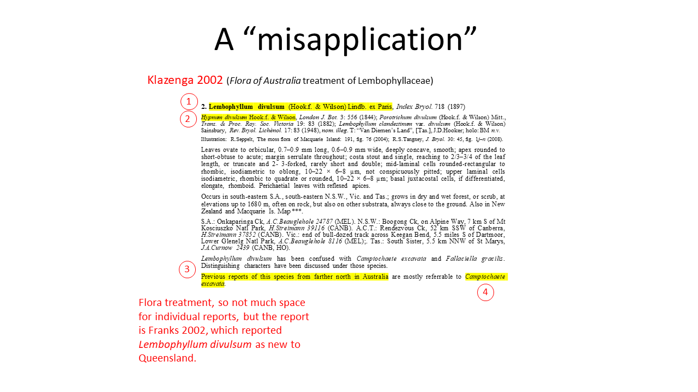
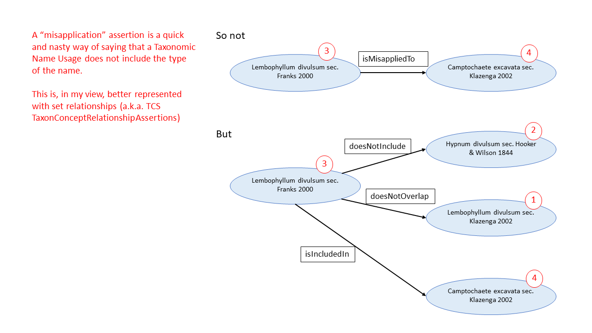
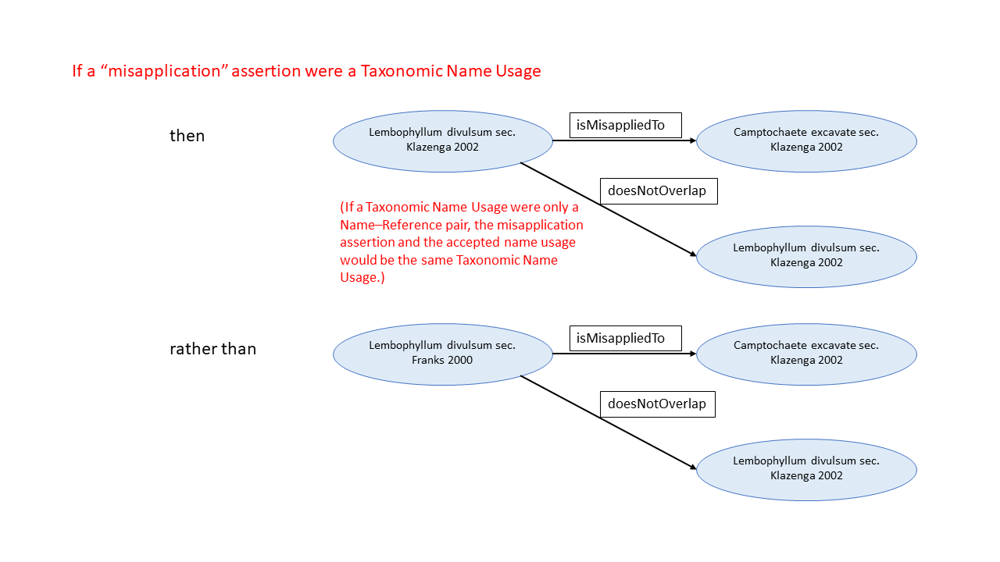

# Misapplication example

**Email from @deepreef, 2019-03-10:**

I think there is a difference between misapplication and misidentification.  The example using “often confused with“ (a statement)  looks very much like the latter.   Synonyms might be about types ( though we usually assume citation of Protonym) but misapplications are nearly always an explicit citation of TNU. An assertion citing a TNU  that includes (as whole or in part) this.taxon within another’s concept - 3 usages in fact  ( a sensu me includes b sensu c not (excludes) b sensu b).   

Otherwise, TCS style assertions are rarely published - I don’t think there are any in APNI - though we have tried to get curators to use them to annotate changing internal concepts.  No luck yet.

**Email from @nielsklazenga, 2019-03-10:**

You're absolutely right, of course, it even comes from an ecological paper, but it is the closest thing I could think of. As I said in the meeting, I am not the right person to provide examples for (assertions of) misapplications, as I don't do them myself.

No, APNI does not have the TCS style relationship assertions. At the moment the infrastructure doesn't allow for them, but we would like to get them in (in the infrastructure that is, APNI is not our decision to make). I think they are actually in a lot of publications, just not in an easily digestible form like synonymy is (they are also in APC as notes), so it requires a bit more interpretation (and a taxonomist to do that). I think proselytising the use of the TCS Taxon Relationship Assertions is an important task for the TNC, after we have delivered the standard, as I reckon they can help us resolve a lot of problems we have now with the handling of names. I also think that "misapplications" can be directly mapped to TCS Taxon Relationship Assertions and that, by doing that, they do not cause the problems they do when they are treated as para-synonyms.

Niels

**Email from @ghwhitbread, 2019-03-11:**

The NSL instance graph is perfectly happy with assertions. We just have to restore the instanceTypes.   There are  assumptions in the editor that will require work to handle some assertion types, like removing restriction on three way assertions, but I am told that that will not be difficult  - they are not there by design.    We should note that *every* NSL relationship instance is an assertion with behavior determined by instanceType. Misapplication instances are not para-synonyms.   In the previous design we used relationships and decomposed assertions.  

In the first “mocked up” NSL, assembled from the contributing parts, we tried to map all relationships to TCS assertions through the TCS services.  Easy enough to do but, never-the-less, a mistake IMHO.  The requirement is for  lossless mapping from work, to repository, to client, and back again.  And the only practical place (currently) for RCC5 in the NSL, unless explicitly stated within reference,  is to describe change in concept with instance replacement within a classification ( Aus sensu CHAH (2016) includes Aus sensu CHAH (2006)).  

Greg

**Email from @deepreef, 2019-03-11:**

Thanks, Greg – this is very helpful.  I’ve always been uncertain about the difference between “misapplication” and “misidentification”, as I’ve seen both terms used in different ways.  If I understand you correctly, I like your approach to them.  That is, we should use the term “misapplication” in the context of tcs:relationshipAssertion – do I understand that correctly?

Aloha,
Rich

**Email from @ghwhitbread, 2019-03-11:**

Well, the term is used very loosely, but yes, when the misapplication assertion cites a taxonomicNameUsage.
[ https://biodiversity.org.au/nsl/services/search?product=APC&name=Avicennia+officinalis ]
Greg

**Email from @nielsklazenga, 2019-03-11:**

The term being used very loosely, therein lies exactly the problem. In the ICBN, 'misapplied name' and 'misidentification' are used interchangeably, and only in the context where the "misapplied name" is the source of a new name. For the new name the same rules apply as if there had not been a misapplied name. I have no problem treating misapplications in this sense similarly to heterotypic synonyms, i.e. they are a separate taxonomic name usage.

I am pretty sure though that most of the instances of "misapplication" in APNI are not this. I don't know exactly how loosely "misapplication" is used in APNI, but I do know how loosely my own colleagues use it, and I have seen the problems misapplied misapplications cause in AVH.

Greg's example is, as far as I can see, a "true" misapplied name. The things that caused the problems in AVH (hasn't happened very often) were not.

I have an example in mosses:

(Klazenga, N. (2003), A revision of the Australasian species of Dicranoloma (Bryophyta, Dicranaceae). Australian Systematic Botany 16: 427–471: 440)

In AusMoss, I have done it like this: https://moss.biodiversity.org.au/nsl/services/rest/name/ausmoss/10004052/api/apni-format, but I am happy to change that to the way it is done for Avicennia officinalis sensu Bentham 1870 in APC. Dicranum sphagni sec. Wilson 1859 was the basis for Dicranum austrinum Mitt. Dicranum austrinum Mitt. was validated with the description of Dicranum sphagni (sec. Wilson 1859) in the Flora Tasmaniae (I think), but Mitten chose different (syn-)types. Dicranoloma diaphanoneuron (sensu me) is a mostly Western Australian species and the collection reported in the Florae Tasmaniae is still the only known record from Tasmania. No labelling error either: I found a species that does not occur in Western Australia mixed with the collection.

On the same page, different column (also under Dicranoloma diaphanoneuron):

And in AusMoss: https://moss.biodiversity.org.au/nsl/services/rest/name/ausmoss/10002464/api/apni-format. Again, happy to change (but not sure how).

Dicranum sphagni Wahlenb. 1812 is a superfluous name for (i.e. includes the type of) Dicranum elongatum Schwägr. 1811.

I think that once we agree on a definition of ‘misapplication’, we’ll also agree on where it sits in the data model. And maybe we do already agree on the definition and my problem with “misapplications” is that I’ve seen them misapplied so often (and that the NSL has a ‘pro parte misapplied’ instance type).

Two of the three instances of the word ‘misapplication’ in the ICZN include the phrase ‘…deliberately used misapplications or misidentifications of previously established names…’ (or ‘…by previous authors…’), so I think the ICZN uses ‘misapplication’ in the sense that the ICBN uses ‘misapplied name’, but I am not sure, as I only did a search and the ICZN and ICBN use the terms in a different context (or that is what it looks like to me, not knowing the context of the ICZN).

Niels
