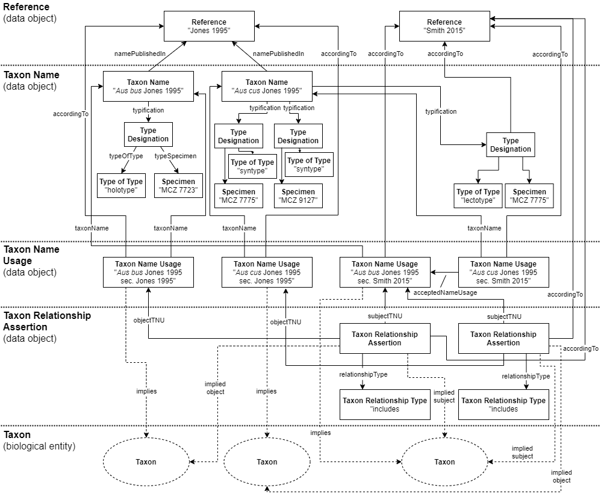

# Yet another Aus bus example

This diagram is inspired by a figure drawn by @jar398 at [https://mumble.net/~jar/tnc/sec-notation.png](https://mumble.net/~jar/tnc/sec-notation.png). This is my (@nielsklazenga's) take on it. I thought it would be a really simple example, but it got a bit out-of-hand.

**Figure 1.** Diagram of relationships between objects in TCS 2.0.0-dev. In the diagram there are two treatments of the genus *Aus*, one by Jones in 1995 and another one by Smith in 2015. Jones 1995 publishes two new names, *Aus bus* and *Aus cus*. Smith 2015 considers *Aus bus* and *Aus cus* conspecific and synonymises *Aus cus* with *Aus bus*. Therefore, *Aus bus* sec. Smith 2015 is the `acceptedNameUsage` of *Aus cus* sec. Smith 2015. The Taxon Relationship Assertions that can be made are that *Aus bus* sec. Smith 2015 `includes` *Aus bus* sec. Jones 2015 and *Aus cus* sec. Jones 2015.

Jones 1995 assigned a holotype for *Aus bus*, but cited two syntypes for *Aus cus* (this is extremely hypothetical; in botanical nomenclature at least this would make *Aus cus* invalid). Smith 2015 selects a lectotype from among these two syntypes. 